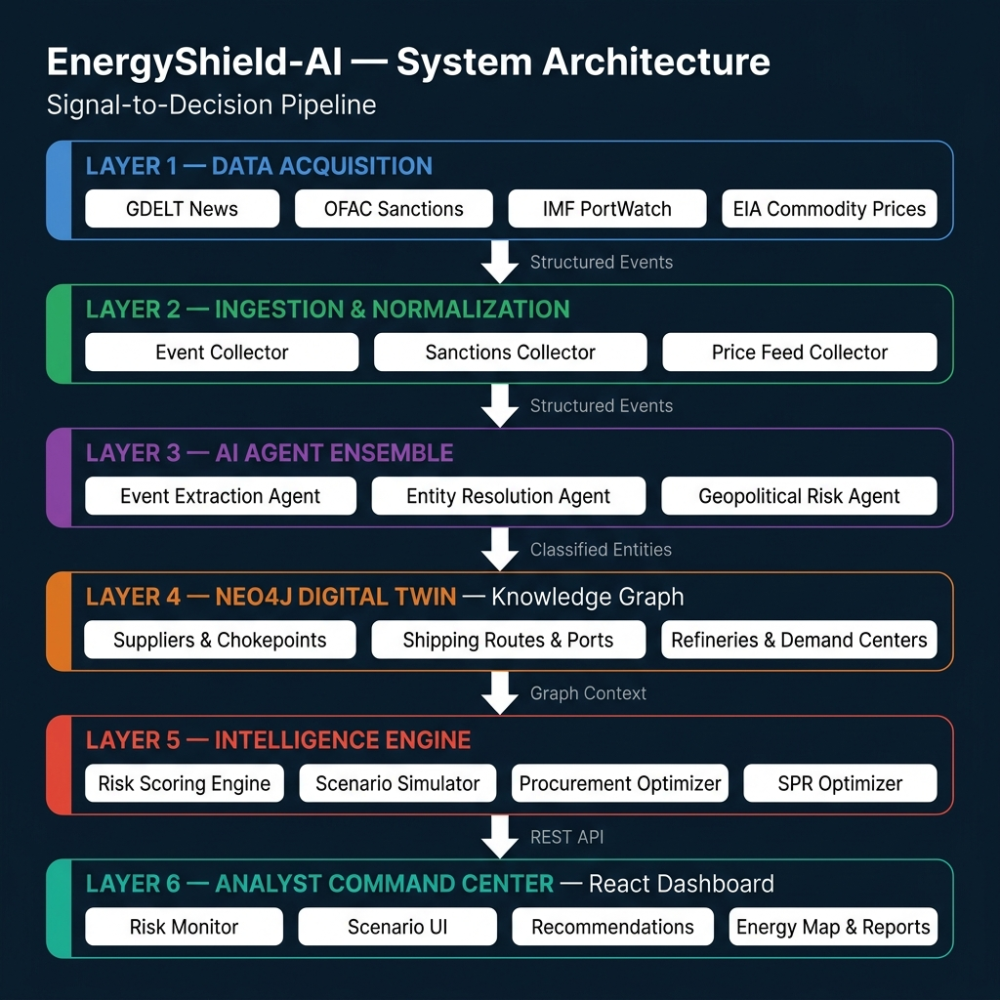

<div align="center">


**Autonomous Energy Supply Chain Resilience & Disruption Modeling**

<br/>


<br/>

*A submission for the **ET AI Hackathon 2026** — Problem Statement 2: AI-Driven Energy Supply Chain Resilience.*

</div>

<hr/>

## Overview

In the modern geopolitical landscape, supply chain disruptions — from canal blockages to sanctions enforcement — can paralyze energy grids, causing massive domestic fuel price hikes and severe GDP drag. Manual analysis is too slow; economies without integrated response intelligence take up to 47 days longer to stabilize.

**EnergyShield-AI** is an agentic AI architecture built to solve this. It fuses real-time global intelligence (GDELT, OFAC, PortWatch, EIA) with a **Geospatial Digital Twin** of the global energy supply chain. The platform continuously monitors chokepoints and suppliers, automatically triggering macroeconomic scenarios and synthesizing alternative procurement plans when critical thresholds are breached.

---

## Key Features

| Feature | Description |
|---|---|
| **Live Ingestion Pipeline** | Autonomously scrapes and processes live geopolitical news (GDELT), sanctions data (OFAC), maritime chokepoint activity (IMF PortWatch), and commodity prices (EIA). |
| **Graph-Based Digital Twin** | Models the complex web of global trade — suppliers, shipping routes, chokepoints, refineries — using Neo4j to instantly trace downstream exposure from any global event. |
| **Disruption Scenario Modeler** | Simulates black-swan events (e.g., Strait of Hormuz closure). Calculates supply drops, shipping delays, and forecasts macroeconomic ripple effects on **Fuel Prices** and **GDP**. |
| **Agentic Procurement AI** | An ensemble of AI agents automatically ranks alternative suppliers, computes rerouting logistics, and recommends Strategic Petroleum Reserve (SPR) drawdowns. |
| **Analyst Command Center** | An executive-level React dashboard that abstracts complex graph mathematics and AI orchestration into clean, actionable intelligence for policymakers and procurement officers. |

---

## System Architecture

EnergyShield-AI follows a clean **6-layer signal-to-decision pipeline** — from raw global signals to actionable procurement intelligence.



> **End-to-end flow:** Global signals are ingested, classified by AI agents, stored in a Neo4j knowledge graph modelling the supply chain as a Digital Twin, scored by the Risk Engine, simulated for downstream economic impact, and surfaced to analysts through a premium React dashboard — all in real-time.

### Tech Stack

| Layer | Technology | Role |
|---|---|---|
| **Data Acquisition** | GDELT · OFAC · IMF PortWatch · EIA | Live geopolitical & commodity intelligence |
| **Ingestion** | Python, Pydantic | Normalization, deduplication, source registry |
| **AI Agents** | Agentic Ensemble (Python) | Event extraction, entity resolution, risk reasoning |
| **Digital Twin** | Neo4j Graph Database | Supply chain relationship mapping & traversal |
| **Intelligence Engine** | FastAPI, custom ML models | Risk scoring, scenario modelling, procurement optimization |
| **Analyst Dashboard** | React 18 · Vite · Recharts | Executive command center for policymakers |

---

## Quickstart & Setup

### Prerequisites


### 1 — Database (Neo4j)
Start your Neo4j instance and note your connection URI (e.g., `bolt://localhost:7687`), username, and password.

### 2 — Backend

```bash
cd backend

# Create and activate a virtual environment
python -m venv venv
source venv/bin/activate   # Windows: venv\Scripts\activate

# Install dependencies
pip install -r requirements.txt

# Configure environment variables
cp .env.example .env
# Edit .env with your Neo4j credentials and API keys

# Seed the Digital Twin knowledge graph
python scripts/seed_graph.py

# Start the API server
uvicorn main:app --reload --port 8000
```

### 3 — Frontend

```bash
cd frontend

npm install
npm run dev
```

### 4 — Access the Platform
Navigate to `http://localhost:5173` to open the Analyst Command Center.

---

## Hackathon Deliverables Alignment

This repository directly fulfills the requirements of **ET AI Hackathon 2026 — Problem Statement 2**:

| Requirement | Status | Implementation |
|---|---|---|
| Real-Time Data Ingestion |  | GDELT, OFAC, PortWatch, EIA live feeds |
| Risk Identification & Forecasting |  | Automated event extraction and risk scoring |
| Disruption Scenario Modeler |  | Supply, delay, freight, fuel price, GDP impact |
| Actionable Recommendations |  | AI-ranked alternative suppliers and SPR plans |

---

## Team

| Role | Member | Core Responsibility |
|---|---|---|
| Frontend & Backend Lead | **Ayush Kumar** | Dashboard UI, backend APIs, database integration, report generation, deployment |
| ML & Agents Lead | **Abhishek Choudhary** | Event extraction, risk scoring, scenario modelling, continuous learning, explainability |
| Data, Orchestration & Knowledge Graph Lead | **Mayur Raj** | Data ingestion, schedulers, orchestration, knowledge graph, procurement orchestration |

---

## License

Distributed under the MIT License. See `LICENSE` for details.
